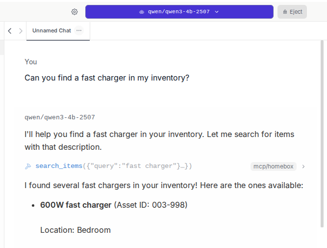
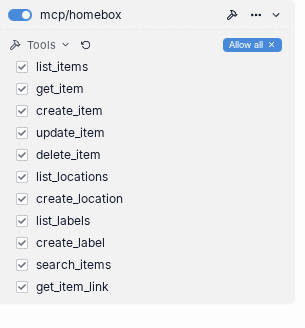
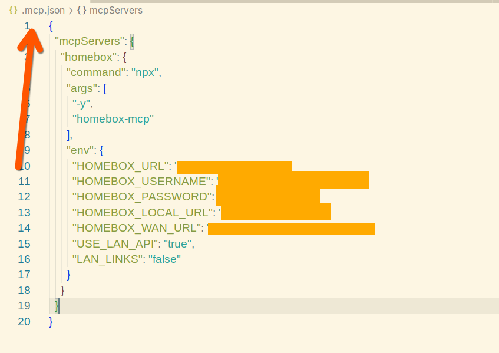
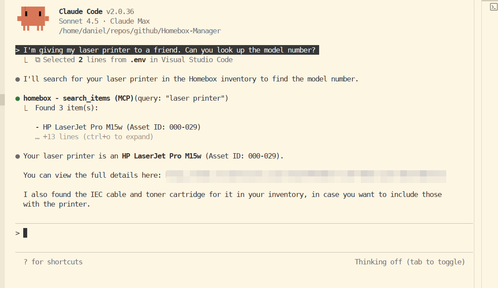
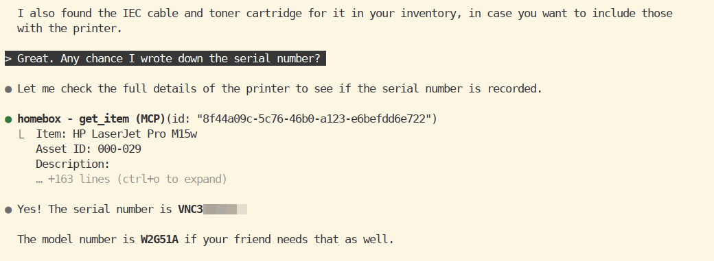

# Homebox MCP Server




A Model Context Protocol (MCP) server for interacting with [Homebox](https://homebox.software/), a self-hosted inventory management system.

**Source Project:** [Homebox](https://github.com/sysadminsmedia/homebox) | [Documentation](https://homebox.software/en/)

## Overview

This MCP server enables AI assistants (like Claude or LM Studio) to interact with your Homebox instance using natural language. You can manage your inventory, create items, update locations, search for items, and more.

**Want to use this with local AI?** Check out our [Local AI Stack Example](docs/examples/local-ai-stack/README.md) for detailed setup instructions using LM Studio + Qwen 3 8B or other local LLMs with function calling support.

## Features

- **Item Management**
  - List all inventory items with filtering and pagination
  - Get detailed information about specific items
  - Create new inventory items
  - Update existing items (including parent-child relationships)
  - Delete items
  - Search items by query
  - Parent-child item relationships (e.g., items stored inside other items)
  - Automatic web links for all items and parent items

- **Location Management**
  - List all storage locations
  - Create new locations (with support for nested/hierarchical locations)
  - Automatic web links for all locations

- **Label Management**
  - List all labels/tags
  - Create new labels with custom colors

- **Flexible URL Configuration**
  - Separate LAN and WAN URL support
  - Automatic URL generation for items, locations, and labels
  - Switch between local and public URLs based on your network context
  - All API calls use efficient LAN access, web links adapt to your needs

## Prerequisites

- Node.js 18+ or later
- A running Homebox instance
- Homebox username and password

## Installation

### Option 1: Install from npm (Recommended)

The easiest way to get started is to install the package directly from npm:

```bash
npm install -g homebox-mcp
```

**Note:** This is currently a proof-of-concept/work in progress. Features may change and improvements are ongoing.

### Option 2: Install from Source

1. Clone this repository:
```bash
git clone https://github.com/danielrosehill/Homebox-MCP-1125.git
cd Homebox-MCP-1125
```

2. Install dependencies:
```bash
npm install
```

3. Build the server:
```bash
npm run build
```

## Configuration

The MCP server supports flexible URL configuration for both LAN and WAN access:

### Environment Variables

- `HOMEBOX_LOCAL_URL` - LAN URL for your Homebox instance (e.g., `http://10.0.0.4:7745`)
- `HOMEBOX_WAN_URL` - (Optional) WAN/public URL for external access (e.g., `https://homebox.yourdomain.com`)
- `USE_LAN_API` - (Optional) Use LAN for API calls (default: `true`). Set to `false` to use WAN for API
- `LAN_LINKS` - (Optional) Use LAN for display links (default: `false`). Set to `true` to force LAN links
- `HOMEBOX_USERNAME` - Your Homebox username (email)
- `HOMEBOX_PASSWORD` - Your Homebox password

**URL Selection Logic:**

**For API calls:**
- By default, uses LAN (`USE_LAN_API=true`) for faster performance
- Set `USE_LAN_API=false` to use WAN for API calls

**For web links:**
- By default, uses WAN if available (`LAN_LINKS=false`)
- If WAN URL is not set, falls back to LAN
- Set `LAN_LINKS=true` to force LAN links even when WAN is available

**How It Works:**
- API calls default to LAN for speed (configurable with `USE_LAN_API`)
- Web links default to WAN for shareability (configurable with `LAN_LINKS`)
- This gives you full control over which URL is used for each purpose

**Note:** The MCP server automatically handles login and token refresh. You don't need to manually generate API tokens.

# Screenshots

## Asset search:


## Env variable configuration:


## Env variables for LAN and WAN instance URLs:


## MCP tools (LM Studio, Qwen 3)



## Retrieve asset URL from asset ID:


---

# Claude Code Demo

Configure by adding array with env variables to `.mcp.json` (note the trailing dot)







---

# MCP Configuration

## Using npm Package (Recommended)

### LAN Only (default)

```json
{
  "mcpServers": {
    "homebox": {
      "command": "npx",
      "args": ["homebox-mcp"],
      "env": {
        "HOMEBOX_LOCAL_URL": "http://10.0.0.4:7745",
        "HOMEBOX_USERNAME": "your_email@example.com",
        "HOMEBOX_PASSWORD": "your_password"
      }
    }
  }
}
```

### Alternative: Using Global Install

If you installed globally with `npm install -g homebox-mcp`:

```json
{
  "mcpServers": {
    "homebox": {
      "command": "homebox-mcp",
      "env": {
        "HOMEBOX_LOCAL_URL": "http://10.0.0.4:7745",
        "HOMEBOX_USERNAME": "your_email@example.com",
        "HOMEBOX_PASSWORD": "your_password"
      }
    }
  }
}
```

## Using Source Installation

If you cloned the repository and built from source:

```json
{
  "mcpServers": {
    "homebox": {
      "command": "node",
      "args": ["/path/to/Homebox-MCP-1125/dist/index.js"],
      "env": {
        "HOMEBOX_LOCAL_URL": "http://10.0.0.4:7745",
        "HOMEBOX_USERNAME": "your_email@example.com",
        "HOMEBOX_PASSWORD": "your_password"
      }
    }
  }
}
```

## WAN Links (automatic when WAN URL is provided)

Given that Homebox is a home inventory system, using the LAN for API calls is preferred where available. Many folks also use WAN URLs to bind to stickers/NFC tags so that they can be read when not on the LAN.

For that reason, env parameters for both WAN and LAN URLs are provided, along with booleans for the preferred URL construction pattern for asset links.

This provides flexibility and accommodates users who want LAN for API but WAN for link presentation:

### Using npx (Recommended)

```json
{
  "mcpServers": {
    "homebox": {
      "command": "npx",
      "args": ["homebox-mcp"],
      "env": {
        "HOMEBOX_LOCAL_URL": "http://10.0.0.4:7745",
        "HOMEBOX_WAN_URL": "https://homebox.yourdomain.com",
        "HOMEBOX_USERNAME": "your_email@example.com",
        "HOMEBOX_PASSWORD": "your_password"
      }
    }
  }
}
```

#### Force LAN Links (even with WAN URL configured)
```json
{
  "mcpServers": {
    "homebox": {
      "command": "npx",
      "args": ["homebox-mcp"],
      "env": {
        "HOMEBOX_LOCAL_URL": "http://10.0.0.4:7745",
        "HOMEBOX_WAN_URL": "https://homebox.yourdomain.com",
        "LAN_LINKS": "true",
        "HOMEBOX_USERNAME": "your_email@example.com",
        "HOMEBOX_PASSWORD": "your_password"
      }
    }
  }
}
```

#### Use WAN for API (not recommended - slower)
```json
{
  "mcpServers": {
    "homebox": {
      "command": "npx",
      "args": ["homebox-mcp"],
      "env": {
        "HOMEBOX_LOCAL_URL": "http://10.0.0.4:7745",
        "HOMEBOX_WAN_URL": "https://homebox.yourdomain.com",
        "USE_LAN_API": "false",
        "HOMEBOX_USERNAME": "your_email@example.com",
        "HOMEBOX_PASSWORD": "your_password"
      }
    }
  }
}
```

### For LM Studio

1. Open LM Studio
2. Go to Settings → MCP Servers
3. Add a new server with the following configuration:
   - **Name**: Homebox
   - **Command**: `npx` (or `homebox-mcp` if globally installed)
   - **Args**: `homebox-mcp` (if using npx; leave empty if using global install)
   - **Environment Variables**:
     - `HOMEBOX_LOCAL_URL`: `http://10.0.0.4:7745`
     - `HOMEBOX_WAN_URL`: `https://homebox.yourdomain.com` (optional, leave empty for LAN-only)
     - `USE_LAN_API`: `true` (optional, default: true - use LAN for API calls)
     - `LAN_LINKS`: `false` (optional, default: false - use WAN for links when available)
     - `HOMEBOX_USERNAME`: `your_email@example.com`
     - `HOMEBOX_PASSWORD`: `your_password`

### For Other MCP Clients

Use the following configuration as a reference:

```json
{
  "mcpServers": {
    "homebox": {
      "command": "npx",
      "args": ["homebox-mcp"],
      "env": {
        "HOMEBOX_LOCAL_URL": "http://10.0.0.4:7745",
        "HOMEBOX_WAN_URL": "https://homebox.yourdomain.com",
        "HOMEBOX_USERNAME": "your_email@example.com",
        "HOMEBOX_PASSWORD": "your_password"
      }
    }
  }
}
```

**Note:** When both `HOMEBOX_LOCAL_URL` and `HOMEBOX_WAN_URL` are provided, the server automatically uses WAN URLs for web links. Set `LAN_LINKS=true` to force LAN links instead.

## Usage Examples

Once configured, you can interact with your Homebox inventory using natural language:

### Listing Items
> "Show me all my inventory items"
> "List items in my garage location"

### Getting Item Links
> "Get the link for asset 003-168"
> "Get the link for asset 5451"
> "What's the link to my Thai cookbook?"
> "Get me the link for the bag of cables"

The server automatically uses Homebox's `#` prefix for asset ID searches, so queries like "5451" or "003-539" will find exact asset ID matches.

The server will return a direct clickable link like:
```
🔗 DIRECT LINK: http://10.0.0.4:7745/item/cd8dee2f-9f5b-4f10-a05b-c952c1deafc5
```

### Searching
> "Find all items related to networking"
> "Search for items with 'laptop' in the name"

### Creating Items
> "Create a new item called 'Dell Monitor' in my office location"
> "Add a new inventory item: Samsung SSD 1TB, model 870 EVO, serial number ABC123"
> "Create a new item called 'USB Cable' inside the electronics box" (requires parent item ID)

### Updating Items
> "Update the quantity of item [ID] to 5"
> "Change the location of my laptop to the office"
> "Set the parent item of [item ID] to [parent item ID]"
> "Remove the parent item from [item ID]" (set parentId to null)

### Managing Locations
> "List all my storage locations"
> "Create a new location called 'Workshop' under 'Garage'"

### Managing Labels
> "Show me all my labels"
> "Create a new label called 'Electronics' with color #0000FF"

## Local AI Setup

For complete instructions on using this MCP server with local AI models, see:

- **[Local AI Stack Setup Guide](docs/examples/local-ai-stack/README.md)** - Complete setup for LM Studio + Qwen 3 8B
- **[Client Configuration Examples](docs/examples/local-ai-stack/client-config-examples.md)** - Configurations for Continue.dev, Cline, Ollama, and more
- **[System Prompt for AI Models](docs/setup/system-prompt.md)** - Recommended system prompt for AI assistants that includes API fallback instructions

Quick summary: Any local LLM with function calling support works (Qwen 3 8B, Llama 3.1, Mistral, etc.).

## Available Tools

### Items
- `list_items` - List inventory items with optional filtering
- `get_item` - Get detailed information about a specific item
- `get_item_link` - **Get direct link to an item by asset ID, name, or description** (recommended for getting links!)
- `create_item` - Create a new inventory item
- `update_item` - Update an existing item
- `delete_item` - Delete an item
- `search_items` - Search for items using a query string

### Locations
- `list_locations` - List all storage locations
- `create_location` - Create a new location

### Labels
- `list_labels` - List all labels/tags
- `create_label` - Create a new label

## Development

### Running in Development Mode
```bash
npm run dev
```

### Building
```bash
npm run build
```

### Running the Built Version
```bash
npm start
```

## API Documentation

This MCP server is built on the Homebox API. For full API documentation, see:
- [Homebox API Documentation](https://homebox.software/en/api/)
- [Complete API Endpoints Reference](docs/api-reference/endpoints-table.md) - Full list of all 64 available API endpoints
- Local API docs in `docs/api-reference/` directory

**Note:** The current MCP implementation provides tools for core functionality (items, locations, labels). Additional functionality planned includes:
- **Maintenance Tracking** - Full CRUD operations for maintenance logs and entries
- **Attachments Management** - Upload, update, and delete item attachments
- **Custom Fields** - Manage custom field names and values
- **Statistics & Reporting** - Access group statistics, purchase price analysis, and bill of materials exports
- **QR Code & Label Generation** - Generate QR codes and printable labels for assets, items, and locations
- **Notifiers** - Configure and test notification systems

See the [endpoints reference](docs/api-reference/endpoints-table.md) for all available API capabilities.

## Understanding Asset IDs vs UUIDs

Homebox uses **two identifiers** for each item:

1. **Asset ID** - Human-friendly label (e.g., `003-168`, `002-145`)
   - What you use to search and identify items
   - Customizable format
   - Easy to remember

2. **UUID (id)** - System identifier (e.g., `cd8dee2f-9f5b-4f10-a05b-c952c1deafc5`)
   - Used internally by Homebox
   - Used in all URLs
   - Never changes

**Example:**
```
When you search for "003-168":
- The MCP server finds the item with assetId "003-168"
- Homebox returns both the assetId AND the UUID
- The URL is built using the UUID: http://10.0.0.4:7745/item/cd8dee2f-9f5b-4f10-a05b-c952c1deafc5
```

**Database Schema:** For detailed database schema information and ERD diagrams, see the `docs/db-schema/` directory which includes both PDF and PNG exports of the full schema and items-specific schema.

## Troubleshooting

### Connection Issues
- Verify your Homebox instance is accessible at the configured URL
- Check that your API token is valid and hasn't expired
- Ensure there are no firewall rules blocking access

### Authentication Errors
- Verify your username (email) and password are correct
- Check if your Homebox account is active and not locked
- The server automatically refreshes tokens, so temporary auth issues should resolve automatically

### Tool Execution Errors
- Check the MCP server logs for detailed error messages
- Verify that the item/location/label IDs are valid UUIDs

### "Can't generate clickable link" Issues
- The MCP server **does** return direct links for all items
- **Use the `get_item_link` tool** - it's specifically designed for getting links!
- Try asking: "Get the link for asset 003-168" or "What's the link to [item name]?"
- Links use UUIDs (not Asset IDs) - this is by Homebox's design
- If your AI client doesn't show links, it may be summarizing the response

## License

MIT

## Author

Daniel Rosehill
 